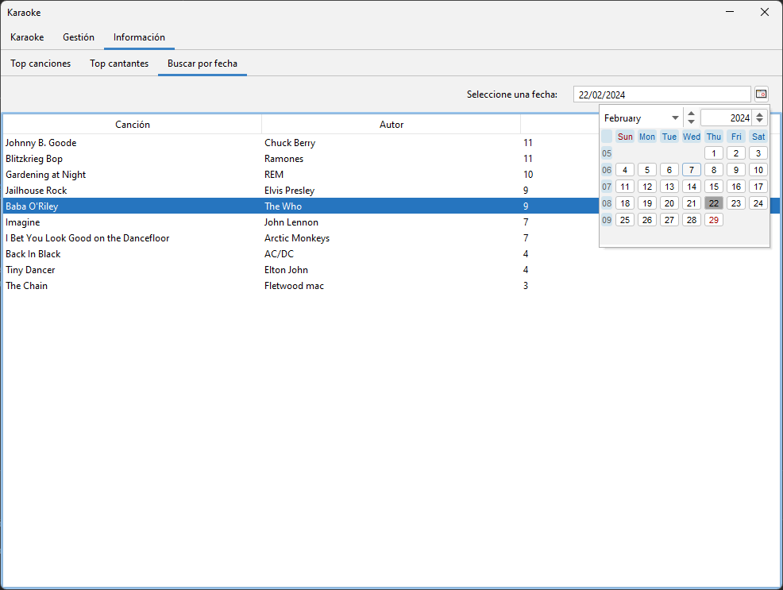
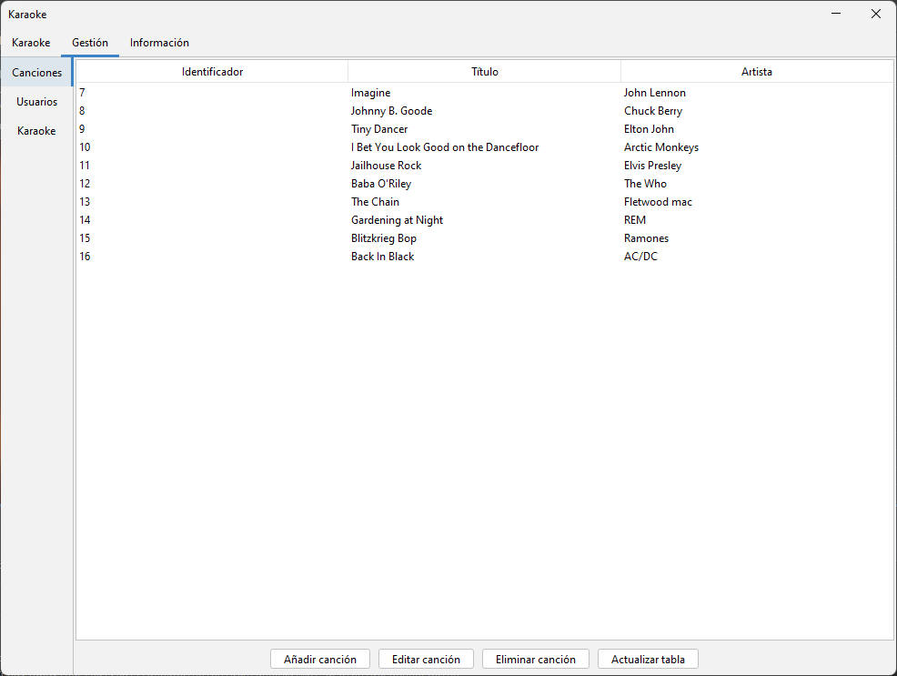
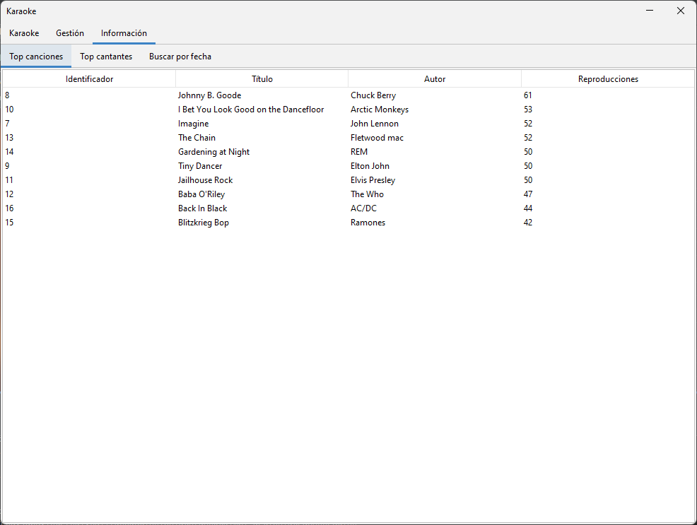

# Karaoke
Karaoke is a simple musical karaoke database manager. It uses Java Swing, and SQL.

> [!NOTE]  
> This app was made when I was a student and had a tight deadline, so don't expect quality code. 

# Images

